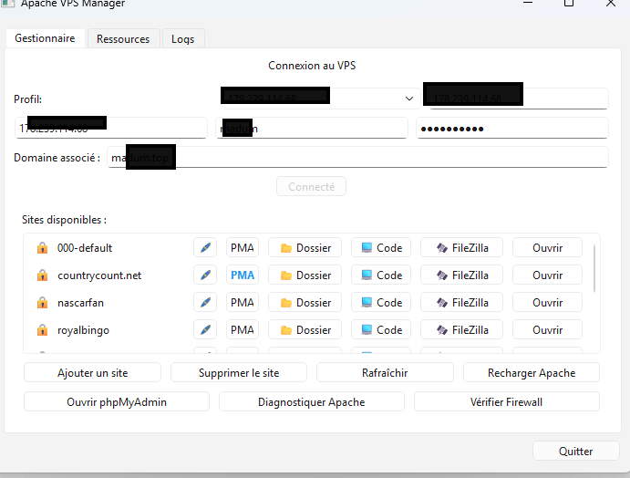

# 🚀 Apache VPS Manager



Un outil puissant et élégant pour administrer vos serveurs Apache distants directement depuis votre bureau. Gérez vos domaines, configurez le SSL et surveillez votre serveur en un clic.

---

## ✨ Fonctionnalités

### 🖥️ Gestion de l'Hébergement
- **Multi-profils** : Enregistrez plusieurs serveurs et basculez de l'un à l'autre instantanément.
- **Déploiement en 1 clic** : Création automatique de dossiers, fichiers `index.html` et configuration du VirtualHost Apache.
- **Accès par Alias** : Vos projets sont accessibles via `mondomaine.com` ou `ip_du_vps/projet`.

### 🗄️ Base de Données & SSL
- **MySQL Automation** : Crée une base de données, un utilisateur dédié et accorde les privilèges automatiquement lors de l'ajout d'un site.
- **Génération SSL (Let's Encrypt)** : Intégration directe de Certbot pour sécuriser vos sites en HTTPS sans ligne de commande.
- **Diagnostic Apache** : Test de configuration et réparation automatique des erreurs courantes.

### 📊 Monitoring Temps Réel
- Dashboard intégré surveillant l'utilisation **CPU**, **RAM** et le **Stockage (SSD)**.
- Mise à jour toutes les 10 secondes via une connexion SSH sécurisée.

### 🛠️ Intégration Développeur
- **Export FileZilla** : Synchronisation automatique du profil (IP, User, Password, Dossier Local & Distant) vers votre Site Manager.
- **VS Code & Dossiers** : Ouvrez vos projets locaux liés en un clic ou naviguez dans les dossiers.

---

## 🛠️ Installation

1. Assurez-vous d'avoir Python 3.10+ installé.
2. Installez les dépendances nécessaires :
   ```bash
   pip install PySide6 paramiko
   ```
3. Lancez l'application :
   ```bash
   python main.py
   ```

---

## 📂 Configuration requise

Sur le VPS (Debian/Ubuntu recommandé) :
- **Apache2** Web Server
- **Let's Encrypt (Certbot)**
- **MySQL Server**
- **Accès SSH** (Root ou utilisateur sudo)

---

## 🚀 Utilisation rapides
1. Connectez-vous à votre VPS via l'onglet Connexion.
2. Ajoutez un site (ou importez vos sites existants en cliquant sur Rafraîchir).
3. Liez vos dossiers locaux pour automatiser FileZilla et VS Code.
4. Profitez du monitoring live dans l'onglet **Ressources**.

---

*Développé avec ❤️ pour simplifier l'administration système.*
